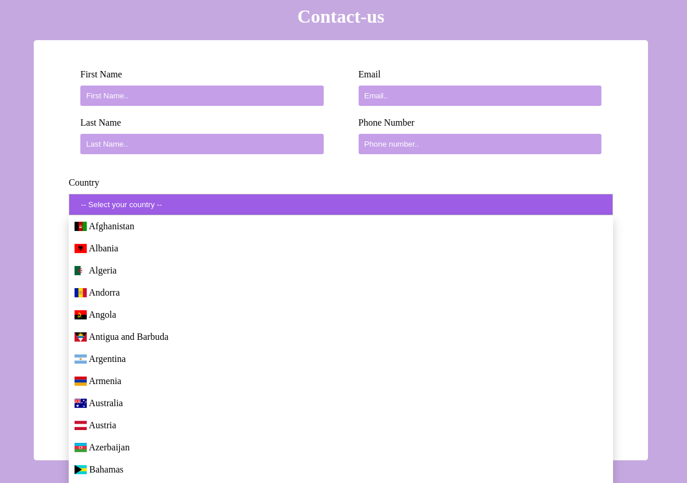

# Solutia nr1 cu emoji: https://github.com/andreicapatina/contact-us-page/tree/solution-with-emoji

```HTML
    <select name="country" id="country">
        <option value="select">-- Select your country --</option>
        <option value="afghanistan">🇦🇫 Afghanistan</option>
        <option value="albania">🇦🇱 Albania</option>
        <option value="algeria">🇩🇿 Algeria</option>
        <option value="andorra">🇦🇩 Andorra</option>
        <option value="angola">🇦🇴 Angola</option>
        <option value="antigua-and-barbuda">🇦🇬 Antigua and Barbuda</option>
        <!-- Alte opțiuni aici -->
    </select>
```


# Solutia nr2 cu div: https://github.com/andreicapatina/contact-us-page/tree/dropdown-with-div

>Hint: s-ar putea că dropdown-ul să trebuiască să fie reconstruit într-un alt mod decât cel clasic.

O metodă ar fi utilizarea stilizării blocurilor `<div>`, însă am folosit JavaScript pentru a construi logica comportamentului butoanelor.
```HTML
<div class="custom-dropdown">
    <button class="dropdown-button">-- Select your country --</button>
    <div class="dropdown-content">
        <div class="option">
            <span class="fi fi-md"></span> Moldova
        </div>
        <!-- Alte opțiuni aici -->
    </div>
</div>

```
