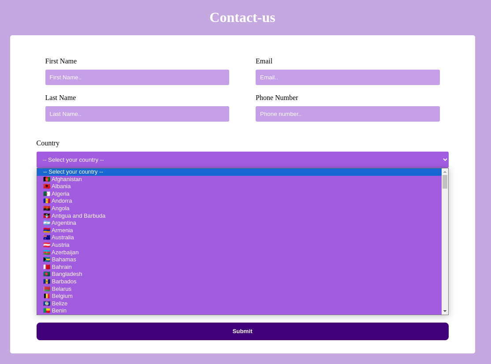
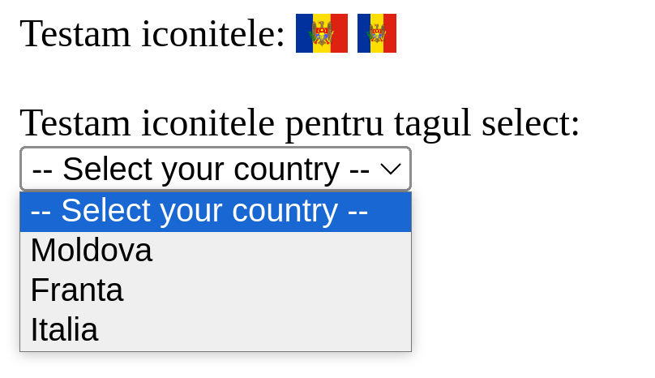
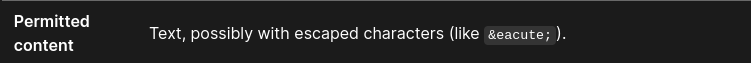

# Solutia nr1 cu emoji: 
https://github.com/andreicapatina/contact-us-page/tree/solution-with-emoji

```HTML
    <select name="country" id="country">
        <option value="select">-- Select your country --</option>
        <option value="afghanistan">🇦🇫 Afghanistan</option>
        <option value="albania">🇦🇱 Albania</option>
        <option value="algeria">🇩🇿 Algeria</option>
        <option value="andorra">🇦🇩 Andorra</option>
        <option value="angola">🇦🇴 Angola</option>
        <option value="antigua-and-barbuda">🇦🇬 Antigua and Barbuda</option>
        <!-- Alte opțiuni aici -->
    </select>
```



# Solutia nr2 cu div: 
https://github.com/andreicapatina/contact-us-page/tree/dropdown-with-div

>Hint: s-ar putea că dropdown-ul să trebuiască să fie reconstruit într-un alt mod decât cel clasic.

O metodă ar fi utilizarea stilizării blocurilor `<div>`, însă am folosit JavaScript pentru a construi logica comportamentului butoanelor.
```HTML
<div class="custom-dropdown">
    <button class="dropdown-button">-- Select your country --</button>
    <div class="dropdown-content">
        <div class="option">
            <span class="fi fi-md"></span> Moldova
        </div>
        <!-- Alte opțiuni aici -->
    </div>
</div>

```


#### Interesting thing with using flag library in <select> <obtion> tags



```HTML
    Testam iconitele:
    <span class="fi fi-md"></span> <span class="fi fi-md fis"></span>
    <br><br>
    Testam iconitele pentru tagul select: <br>
    <select name="country" id="country">
        <option value="select">-- Select your country --</option>
        <option value="moldova"><span class="fi fi-md"></span>Moldova</option>
        <option value="franta">Franta</option>
        <option value="italia">Italia</option>
    </select>
```

Iconița steag din tagul `<option>` nu apare, deși în afara acestuia apare. Se pare că `<option>` nu suportă includerea altor taguri precum `<span>`, sau cel puțin nu în toate browserele.

https://developer.mozilla.org/en-US/docs/Web/HTML/Element/option

